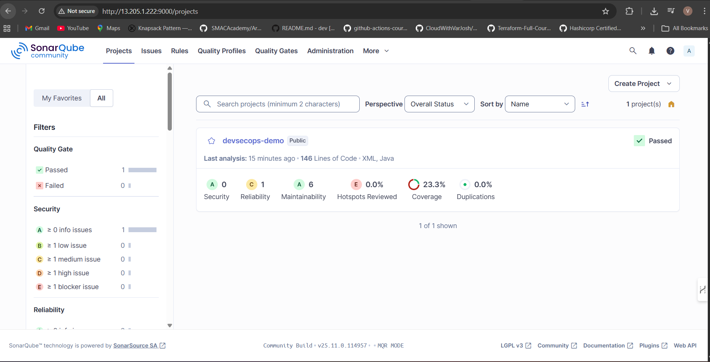
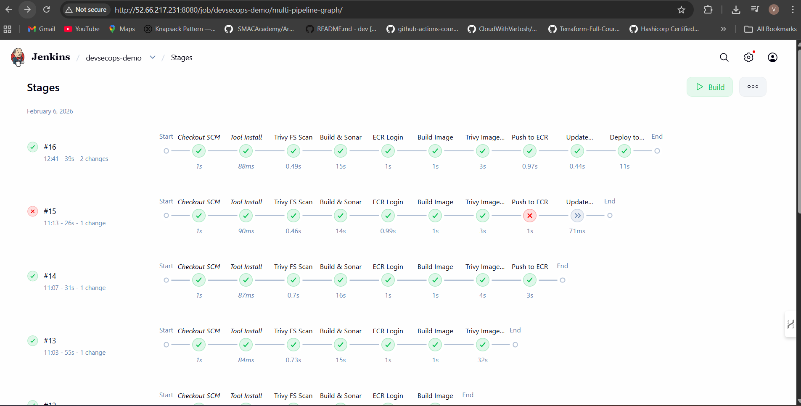

# 🚀 Complete DevSecOps CI/CD Pipeline on AWS

## 📌 Project Overview

Multi-AZ Amazon EKS + Jenkins + Trivy + SonarQube + Amazon ECR + GitHub

This project demonstrates a **complete end-to-end DevSecOps CI/CD pipeline** built on AWS using **Amazon EKS (Multi-AZ)** for high availability and scalability.

The pipeline integrates security at every stage of the Software Development Life Cycle (SDLC), following DevSecOps best practices.

---

## 🏗️ Architecture Overview

GitHub → Jenkins → SonarQube → Trivy → Docker → Amazon ECR → Amazon EKS

---

## ⚙️ Tech Stack

| Tool / Service | Purpose |
|---------------|----------|
| GitHub | Source Code Management |
| Jenkins | CI/CD Orchestration |
| SonarQube | Static Code Analysis (SAST) |
| Trivy | Container Vulnerability Scanning |
| Docker | Containerization |
| Amazon ECR | Private Image Registry |
| Amazon EKS | Kubernetes Orchestration |
| AWS EC2 | Jenkins & SonarQube Hosting |

---

## 🔄 CI/CD Pipeline Stages

### 1️⃣ Checkout Code
- Pulls latest source code from GitHub

### 2️⃣ Tool Installation
- Installs required dependencies

### 3️⃣ Trivy File System Scan
- Scans source code for vulnerabilities before build

### 4️⃣ Build & SonarQube Analysis
- Builds application
- Performs static code analysis
- Validates Quality Gate

---

### 5️⃣ Docker Build
- Creates container image

### 6️⃣ Trivy Image Scan
- Scans Docker image for HIGH & CRITICAL vulnerabilities
- Fails pipeline if vulnerabilities detected

---

### 7️⃣ Push to Amazon ECR
- Securely pushes validated image to private registry

---

### 8️⃣ Deploy to Amazon EKS
- Updates Kubernetes deployment
- Rolls out new version

---

## 🌍 Application Live on EKS

After successful pipeline execution, the application is deployed to the Amazon EKS cluster and exposed via Kubernetes Service / LoadBalancer.

Below is the live application running in the cluster:

✔ Successfully deployed via CI/CD  
✔ Running inside Kubernetes Pods  
✔ Exposed using Kubernetes Service  
✔ Built, scanned, and validated through DevSecOps pipeline  

---

## 📊 Jenkins Pipeline Execution

✔ Automated  
✔ Secure  
✔ Production-ready  

---

## 🔐 Security Implementation (DevSecOps)

- SAST using SonarQube
- Container vulnerability scanning using Trivy
- Image validation before ECR push
- Kubernetes deployment only after security validation
- Exit code enforcement for HIGH & CRITICAL issues

---

## ☁️ Infrastructure Details

- Multi-AZ EKS Cluster
- Managed Node Groups
- IAM Roles for Service Accounts (IRSA)
- Private ECR Repository
- Secure Jenkins setup
- Kubernetes v1.32

---

## 📈 Key Achievements

- ✅ End-to-end automated CI/CD
- ✅ Shift-left security integration
- ✅ Zero HIGH/CRITICAL vulnerabilities allowed
- ✅ Automated container deployment to EKS
- ✅ Cloud-native architecture
- ✅ Production-grade DevSecOps implementation

---

## 🎯 Learning Outcomes

- Real-world DevSecOps implementation
- Kubernetes deployment automation
- CI/CD security integration
- AWS container ecosystem (ECR + EKS)
- Pipeline failure handling
- Secure container lifecycle management

---

🙏 Special Thanks

**[CloudWithVarJosh](https://github.com/CloudWithVarJosh)**

**[Varun Joshi](https://github.com/CloudWithVarJosh)**
For valuable cloud learning resources and DevOps guidance.

---

## ⭐ If you like this project

Give it a ⭐ on GitHub and connect with me!

